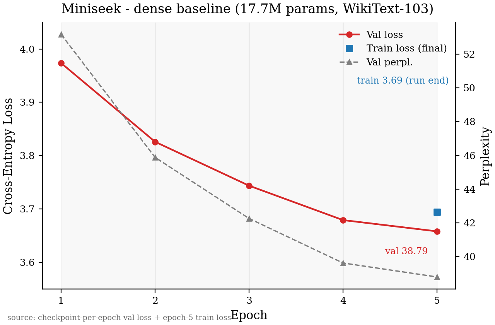

# Miniseek

Incremental LLM research project — a dense decoder-only transformer built from
scratch (GPT-2 / LLaMA-style), evaluated on WikiText-103. The goal is a
measurement-lab: each architectural change (MLA, MoE, MTP, ...) gets compared
against dense controls at the same token budget.

**Current status: Phase 1 (dense baseline) complete.**

| Metric                        | Value                                          |
|-------------------------------|------------------------------------------------|
| Parameters                    | **17,686,016** (17.69M)                        |
| Training tokens (corpus)      | **117,919,088** (WikiText-103 train split)     |
| Tokens processed (5 epochs)   | **589,660,160** (~590M)                        |
| Final train loss              | 3.6944                                         |
| Final validation loss         | 3.6582                                         |
| Final validation perplexity   | **38.79**                                      |



Validation loss falls steadily from 3.97 (epoch 1) to 3.66 (epoch 5). The model
is *capacity-limited, not data-limited*: Chinchilla-optimal training for 17.7M
params is ~354M tokens, so the corpus alone is enough — the 100M-parameter
Phase 2 control is what moves loss below ~3.0.

## Model architecture

Decoder-only stack: pre-norm attention + SwiGLU feed-forward, RoPE positional
encoding, RMSNorm, tied input/output embeddings, GPT-2 BPE vocabulary (50,257).

| Component        | Value                                        |
|------------------|----------------------------------------------|
| Embedding dim    | 256                                          |
| Layers           | 6                                            |
| Attention heads  | 8 × head_dim 32                              |
| FFN hidden       | 704 (SwiGLU)                                 |
| Max sequence len | 1024                                         |
| Norm             | RMSNorm (eps 1e-6)                           |
| Positional       | RoPE (base 10_000)                           |
| Dropout          | 0.1                                          |
| Tied embeddings  | yes                                          |

**Parameter breakdown (17,686,016 total):**

| Block                                   | Params  | Share |
|-----------------------------------------|---------|-------|
| Embedding / LM head (tied, 50257×256)   | 12,865,792 | 72.7% |
| Per-layer attention (QKV+O, 256×256×4)  | 262,144  | —     |
| Per-layer SwiGLU (gate/up 256→704, down 704→256) | 540,672 | — |
| Per-layer RMSNorm (2×256)               | 512      | —     |
| 6 layers total                          | 4,819,968 | 27.3% |
| Final RMSNorm                          | 256      | —     |

The vocab dominates: 73% of parameters are the shared input/output embedding
table. Configs declare `expected_params_million` and the loader raises if the
built model disagrees (currently 17.69).

## Dataset & token accounting

- **Dataset:** WikiText-103 (raw split), tokenized with GPT-2 BPE
  (`wikitext-103-raw-v1`). No filtering or deduplication.
- **Train split:** 1,165,029 documents → 117,919,088 tokens.
- **Windows:** 1024 tokens per sequence → 115,155 sequences; batch size 16 →
  7,198 gradient steps per epoch.
- **Tokens per epoch:** 7,198 × 16 × 1024 = **117,932,032** (~117.9M).
- **Total processed:** × 5 epochs = **589,660,160** tokens (~590M).

## Training details

- **Hardware:** single NVIDIA A10G via Modal (~36 min/epoch).
- **Optimizer:** AdamW (β=0.9/0.95, weight decay 0.01), LR 6e-4 → 6e-5 cosine
  decay with 100-step warmup, gradient clipping at 1.0, AMP autocast.
- **Logging:** per-epoch JSONL to `logs/<run>/training_log.jsonl`; checkpoints
  (per-epoch + `best_model.pt`) and cached `.npz` datasets on the Modal volume.

| Epoch | Steps  | Val Loss | Val PPL |
|-------|--------|----------|---------|
| 1     | 7,198  | 3.9735   | 53.17   |
| 2     | 14,396 | 3.8260   | 45.88   |
| 3     | 21,594 | 3.7438   | 42.26   |
| 4     | 28,792 | 3.6793   | 39.62   |
| 5     | 35,990 | 3.6582   | 38.79   |

## Qualitative check

Generated samples for 9 prompts live in
[`response_lm.txt`](response_lm.txt). Output is fluent at the surface level
but semantically incoherent — expected at perplexity ~39. A memorization probe
(anchor-token matching against the 117.9M-token train split) found the longest
verbatim span to be **0–1 tokens**: the model generates fresh text and does not
regurgitate training data.

## Project structure

```
miniseek/
├─ configs/                 # YAML run configs (phase1_debug, smoke_realdata)
├─ figures/                 # Loss-curve figures (from scripts/plot_loss_curve.py)
├─ scripts/
│  ├─ train.py              # Local CPU training entrypoint
│  ├─ modal_train.py        # Modal app (download, train, generate, ckpt_history)
│  └─ plot_loss_curve.py    # Plots training_log.jsonl (or the committed baseline)
├─ src/
│  ├─ model.py              # Decoder transformer (config-driven)
│  ├─ attention.py          # Causal MHA
│  ├─ rope.py               # Rotary position embeddings
│  ├─ norm_activation.py    # RMSNorm, SwiGLU
│  ├─ tokenizer.py          # GPT-2 BPE wrapper
│  ├─ data.py               # WikiText-103 dataloader / .npz cache
│  ├─ train.py              # Training loop + JSONL logging
│  └─ generate.py           # Sampling
├─ tests/                   # Unit tests (params, forward, shapes)
├─ logs/                    # Training JSONL logs
├─ checkpoints/             # Saved models
└─ data/                    # Local dataset cache
```

## Quick start

```bash
pip install -r requirements.txt

# Unit tests
python tests/test_model.py

# Local CPU smoke run (logs to logs/smoke/)
python scripts/train.py --config configs/smoke_realdata.yaml

# Plot a loss curve from a JSONL log (defaults to the phase-1 baseline)
python scripts/plot_loss_curve.py            # baseline
python scripts/plot_loss_curve.py logs/smoke/training_log.jsonl
```

GPU training runs through Modal:

```bash
modal run scripts/modal_train.py --skip-download        # train
modal run scripts/modal_train.py::generate              # sample from best_model.pt
modal run scripts/modal_train.py::ckpt_history          # per-epoch val loss from checkpoints
```

The `.modalignore` keeps `data/`, `checkpoints/`, `logs/` and `*.npz` out of the
source image; datasets and checkpoints live on the persistent `miniseek-data`
volume at `/data`.

## Roadmap

```
Phase 1: Dense baseline (17.7M)        ✓ committed
Phase 2: Dense control (100M, temp.)   ◷ next
Phase 3: Experiments (MLA, MoE, MTP)
Phase 4: Final Miniseek (100–150M)
```

## References

- GPT-2 / nanoGPT (Karpathy)
- LLaMA architecture (RoPE, RMSNorm, SwiGLU)
- WikiText-103 benchmark