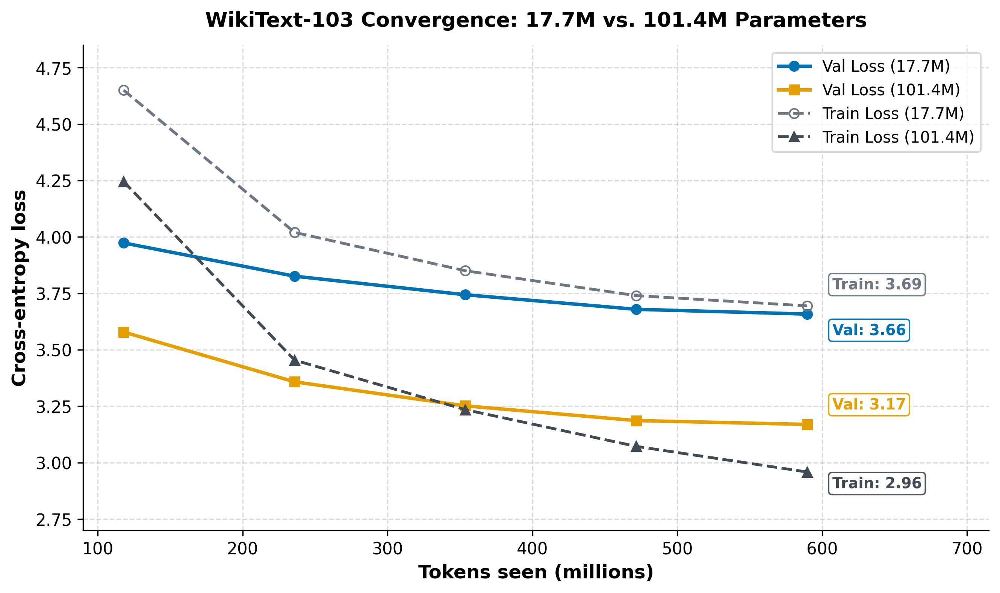

<div align="center">

# Miniseek

**A from-scratch decoder-only language model, trained and measured honestly.**

From a 17.7M-parameter baseline to a 101.4M-parameter model — first on
WikiText-103 at a fixed token budget, then continued on a self-built ~1B-token
science corpus — with full cost accounting throughout.

`v0.1` · 17.7M → 101.4M params · WikiText-103 + 1B science corpus · Modal A10G


</div>

---

## Overview

This repository builds a small language model entirely in PyTorch and measures
its behavior rigorously at every stage:

- **Phase 1** — a 17.7M-parameter dense baseline (5 epochs ≈ 590M tokens of
  WikiText-103).
- **Phase 2** — a 101.4M-parameter dense control trained on the same WikiText
  token budget, isolating the effect of scale.
- **Phase 3** — continued pretraining of the Phase-2 model on a ~1B-token
  science corpus, curated from FineWeb-Edu (life sciences, physical sciences,
  mathematics, environmental science).

The emphasis throughout is on reproducible, honestly-reported results:
validation losses, perplexities, GPU costs, and qualitative samples are all
recorded. Full model samples live in [`response_lm.txt`](response_lm.txt).

## Results

### WikiText pretraining (Phases 1–2)

Scaling the model **5.7×** at a fixed token budget lowered validation loss from
**3.658 → 3.169** and perplexity from **38.8 → 23.8**.

| Metric | Phase 1 (17.7M) | Phase 2 (101.4M) |
|--------|----------------:|-----------------:|
| Parameters | 17,686,016 | 101,360,512 |
| Tokens per epoch | 117,919,088 | 117,919,088 |
| Epochs | 5 | 5 |
| Effective batch | 16 × 1024 tok | 8 × grad-accum 4 → 32 |
| Final train loss | 3.6944 | 2.9586 |
| Final val loss | 3.6582 | **3.1694** |
| Final val perplexity | 38.79 | **23.79** |
| GPU cost | ~$6.00 | **$17.02** (≤ $24 cap) |



Regenerate with `python scripts/loss.py` (writes `figures/loss.png`).
*Heads-up: Phase-1 train-loss for epochs 1–4 in the figure is an estimate —
only the epoch-5 value (3.6944) was logged. All val-loss curves are exact.*

### Science-corpus continued pretraining (Phase 3, ~1B tokens)

The Phase-2 model is resumed on a curated ~1B-token science corpus built from
[`mdonigian/fineweb-edu-curated`](https://huggingface.co/datasets/mdonigian/fineweb-edu-curated),
filtered to four science groups — life sciences, physical sciences,
mathematics, environmental. Chemistry is excluded; documents outside 32–16,000
tokens are dropped; 2% of tokens are held out for validation
(`data-layer/corpus.py`).

Training ran in two segments (configs `1b_corpus.yaml`, `1b_corpus_seg2.yaml`),
the second with a higher LR restart, under the same $30 budget guard:

| Run | Segment | Epoch | Train loss | Val loss | Val ppl | Cumulative GPU cost |
|-----|---------|------:|-----------:|---------:|--------:|--------------------:|
| `logs/1b_seg1` | seg1 (LR 6e-6) | 1 | 3.8116 | 3.7849 | 44.03 | $27.63 |
| `logs/1b_seg2` | seg2-lr (LR 3e-5) | 2 | 3.5968 | **3.5589** | **35.13** | $27.98 |

Final checkpoint: `/data/checkpoints/phase3_seg2_lr`. Note that Phase-3
validation is measured against the science corpus holdout, *not* WikiText-103,
so it is not directly comparable to the Phase-1/2 numbers above.

## What the model learned — and what it did not

Full samples for all checkpoints are in [`response_lm.txt`](response_lm.txt).

### Learned

- **English syntax.** Sentences are grammatical, punctuated, and spelled
  correctly.
- **Encyclopedic genre.** The model reproduces WikiText's prose structure,
  including `==== Heading ====` section markup.
- **Some domain vocabulary.** After the science-corpus pass, prompts like
  *"DNA is the molecule that carries"*, *"Antibodies are produced by"*, and
  *"Hemoglobin is the protein that transports"* begin with plausible
  continuations before drifting.
- **No verbatim memorization.** A training-data overlap probe (anchor-token
  matching against the training split) finds 0–1 token exact matches — output
  is generated, never regurgitated.
- **Generalization at scale.** Train 2.96 vs val 3.17 at 101.4M params means
  the model learns transferable structure rather than over-fitting.

### Not learned

- **No reliable factual retrieval.** Knowledge probing (temperature 0.1,
  top-k 5):
  - *"The capital of France is"* → "the capital of the Kingdom of France"
  - *"The Earth revolves around"* → "the city of the city"
  - *"World War II began in"* → "the late 1950s"
  - *"Water … boils at"* → "0 degrees altitude"
  - Score: **0/10**.
- **No arithmetic.** *"2 + 2 is equal to"* → "the 0.5c4 + 2 −".
- **No long-range coherence.** Topics drift without warning (Roman Empire → a
  1980s pop song) even after the 1B-token pass.

### Why

1. **Data distribution.** Neither WikiText nor a web science corpus is written
   as Q&A, so the question-to-answer shape is absent from training. A
   GPT-2-sized model only recalls facts when that shape appears in the data.
2. **Not enough tokens.** GPT-2 (117M params, ≈ this scale) required ~10B
   tokens of diverse web text before factual recall appeared. Roughly 1.6B
   tokens across three phases is about 1/6 of that — the model is both
   capacity-limited and data-limited.
3. **Wrong objective.** Next-token prediction optimizes *plausible text*, not
   *correct answers*. Decoding settings (temperature, top-k) tune style, never
   knowledge.
4. **Baseline literacy gap.** A validation perplexity of ~35 after the science
   pass is still high; a fluent LM needs ppl ≲ 15, and facts only emerge as
   perplexity falls into that range.

### Path forward

- **More data, more diverse** — multi-domain web and books (a 5–10B-token
  pipeline) instead of repeated epochs over a single corpus.
- **Higher scale** — the Phase-2 validation curve was still descending at epoch
  5; a 101M model trained on 2B+ tokens is the natural next step.
- **Question-answer shaping** — teaching the model the Q&A format explicitly
  only helps if it is backed by enough diverse text that it has something to
  retrieve.

## Model architecture

Decoder-only stack: pre-norm attention + SwiGLU feed-forward, RoPE positional
encoding, RMSNorm, tied input/output embeddings, GPT-2 BPE vocabulary (50,257).

| Component | Phase 1 (17.7M) | Phase 2/3 (101.4M) |
|-----------|-----------------|--------------------|
| Embedding dim | 256 | 704 |
| Layers | 6 | 12 |
| Attention heads | 8 × head 32 | 8 × head 88 |
| FFN hidden (SwiGLU) | 704 | 1664 |
| Max sequence len | 1024 | 1024 |
| Norm | RMSNorm (eps 1e-6) | RMSNorm (eps 1e-6) |
| Positional | RoPE (base 10 000) | RoPE (base 10 000) |
| Dropout | 0.1 | 0.1 |
| Tied embeddings | yes | yes |

The vocabulary dominates the parameter count: in Phase 1, the shared
embedding/LM-head table (50,257 × 256) is 72.7% of all parameters. Configs
declare `expected_params_million` and the loader raises if the built model
disagrees (17.69 / 101.36).

## Data & token accounting

- **WikiText-103** (`wikitext-103-raw-v1`), GPT-2 BPE, no filtering or
  deduplication: 1,165,029 train docs → 117,919,088 tokens → 115,155 windows.
  Phase 1: batch 16 → 590M tokens total. Phase 2: effective batch 32
  (verified byte-for-byte equivalent to a real batch-32 step) → 590M tokens.
- **Science corpus** (`data-layer/`, target `data/science1b`): streams
  `mdonigian/fineweb-edu-curated`, keeps life/physical sciences, mathematics
  and environmental documents, excludes chemistry, targets **1B train tokens**
  with a 2% validation holdout.

## Training details

- **Hardware:** single NVIDIA A10G via Modal (~36 min/epoch at 17.7M params,
  ~1.6 h/epoch at 101.4M on WikiText).
- **Optimizer:** AdamW (β 0.9/0.95, wd 0.01), cosine LR (Phase 1/2: 6e-4 → 6e-5,
  warmup 100/200 steps; Phase 3 seg1: 6e-6 → 6e-7; seg2: 3e-5 → 3e-6),
  grad clip 1.0, AMP autocast.
- **Logging:** per-epoch JSONL to `logs/<run>/training_log.jsonl`; per-epoch +
  `best_model.pt` + `latest.pt` checkpoints on the `miniseek-data` volume.

### Budget-aware training (cap = $24 / $30)

- Cost cap tracked in a persistent ledger (`<log_dir>/cost_ledger.json`),
  accumulated across every run and resume. Phase 2 spent **$17.02**; Phase 3
  (science corpus) brought the cumulative total to **$27.98**.
- Training stops cleanly before/within an epoch that would exceed the cap, after
  projecting GPU time × `usd_per_hour: 2.0` (measured at $6/3h on A10G in
  Phase 1).
- Full state (model + optimizer + scheduler + scaler + RNG + step) is saved to
  `latest.pt` and is resumable across Modal accounts:
  `modal run scripts/modal_train.py --config-name phase2_100m.yaml --resume latest.pt`.

## Project structure

```
miniseek/
├─ configs/                  # phase1/2, 1b_corpus (+seg2), smoke, debug
├─ data-layer/               # Science-corpus builder (corpus, shards, filters, tokenization)
├─ figures/                  # loss.png (from scripts/loss.py)
├─ scripts/
│  ├─ train.py               # Local CPU training entrypoint (smoke tests)
│  ├─ modal_train.py         # Modal app (corpus build, train, generate, ckpt_history)
│  └─ loss.py                # Phase 1 vs Phase 2 comparison figure
├─ src/
│  ├─ model.py               # Decoder transformer (config-driven)
│  ├─ attention.py           # Causal multi-head attention
│  ├─ rope.py                # Rotary position embeddings
│  ├─ norm_activation.py     # RMSNorm, SwiGLU
│  ├─ tokenizer.py           # GPT-2 BPE wrapper
│  ├─ data.py                # Dataloaders (WikiText + local corpus) / .npz cache
│  ├─ train.py               # Training loop + JSONL logging + budget ledger
│  └─ generate.py            # Sampling
├─ tests/                    # Unit tests (params, forward, shapes)
├─ probes.txt                # Knowledge-probe prompts (used by generate)
├─ response_lm.txt           # Human-readable model samples (Phases 1–3)
└─ data/ logs/ checkpoints/  # Local caches (git-ignored)
```

## Quick start

```bash
pip install -r requirements.txt

# Unit tests
python tests/test_model.py

# Local CPU smoke run
python scripts/train.py --config configs/smoke.yaml

# Regenerate the comparison figure
python scripts/loss.py

# Build the ~1B-token science corpus (local machine)
python data-layer/corpus.py --out ./data/science1b

# Sample from the Phase-3 checkpoint
modal run scripts/modal_train.py::generate \
  --prompts-file probes.txt --temperature 0.1 --top-k 5 --no-memorization-check
```

The `.modalignore` keeps `data/`, `checkpoints/`, `logs/`, `scratch/` and
`*.npz` out of the source image; datasets and checkpoints live on the persistent
`miniseek-data` volume at `/data`.

## Roadmap

```
Phase 1: Dense baseline (17.7M, WikiText)        ✓ complete (val 3.658)
Phase 2: Dense control (101.4M, WikiText)        ✓ complete (val 3.169, $17.02)
Phase 3: 1B science-corpus continuation (101.4M) ✓ complete (val 3.559, $27.98)
Phase 4: Miniseek 2 (100–150M, 5–10B tokens, Q&A shape in data)
```

## References

- GPT-2 / nanoGPT (Karpathy)
- LLaMA architecture (RoPE, RMSNorm, SwiGLU)
- WikiText-103 benchmark
- FineWeb-Edu (`mdonigian/fineweb-edu-curated`)
- Chinchilla scaling laws (data × model-size trade-offs)